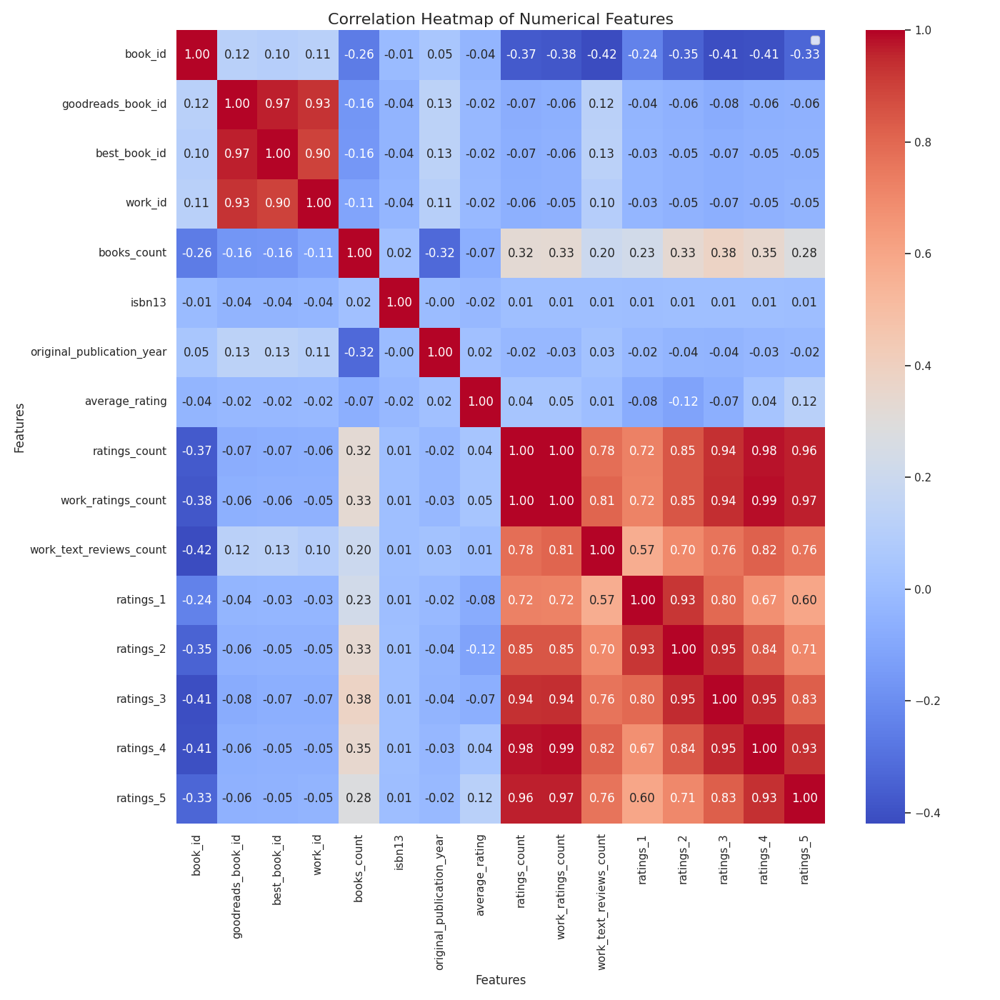
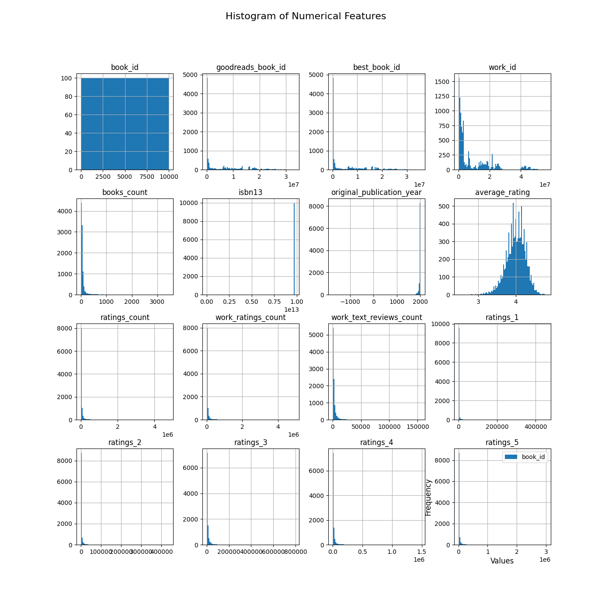
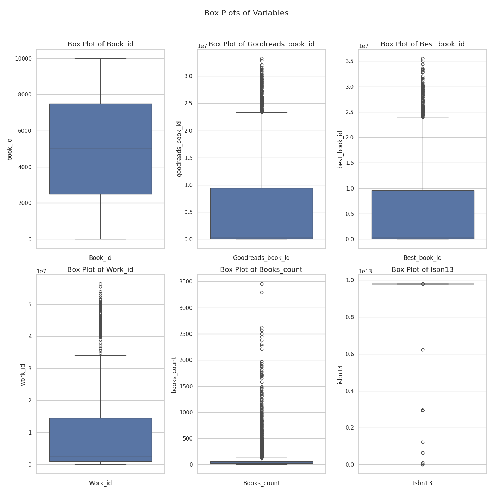

# Data Analysis Project 
Hey! Hope you are doing fine. Hmm... You've got some interesting data I see.  
Let's begin this journey with first identifying what your data is like.  
So, you have got 10000 rows and 23 columns in your data and as I can  
see this data is related to Books. Below are some key statistics  
about the data you provided  

## Missing Value Analysis
The dataset contains the following missing values:

| Column                    |   Missing Values |   Percentage |
|:--------------------------|-----------------:|-------------:|
| book_id                   |                0 |         0    |
| goodreads_book_id         |                0 |         0    |
| best_book_id              |                0 |         0    |
| work_id                   |                0 |         0    |
| books_count               |                0 |         0    |
| isbn                      |              700 |         7    |
| isbn13                    |                0 |         0    |
| authors                   |                0 |         0    |
| original_publication_year |                0 |         0    |
| original_title            |              585 |         5.85 |
| title                     |                0 |         0    |
| language_code             |             1084 |        10.84 |
| average_rating            |                0 |         0    |
| ratings_count             |                0 |         0    |
| work_ratings_count        |                0 |         0    |
| work_text_reviews_count   |                0 |         0    |
| ratings_1                 |                0 |         0    |
| ratings_2                 |                0 |         0    |
| ratings_3                 |                0 |         0    |
| ratings_4                 |                0 |         0    |
| ratings_5                 |                0 |         0    |
| image_url                 |                0 |         0    |
| small_image_url           |                0 |         0    |

## Advanced Statistical Analysis
|                           |            mean |              std |            min |             25% |              50% |             75% |              max |   Skewness |   Kurtosis |
|:--------------------------|----------------:|-----------------:|---------------:|----------------:|-----------------:|----------------:|-----------------:|-----------:|-----------:|
| book_id                   |  5000.5         |   2886.9         |     1          |  2500.75        |   5000.5         |  7500.25        |  10000           |       0    |      -1.2  |
| goodreads_book_id         |     5.2647e+06  |      7.57546e+06 |     1          | 46275.8         | 394966           |     9.38223e+06 |      3.32886e+07 |       1.35 |       0.69 |
| best_book_id              |     5.47121e+06 |      7.82733e+06 |     1          | 47911.8         | 425124           |     9.63611e+06 |      3.55342e+07 |       1.35 |       0.75 |
| work_id                   |     8.64618e+06 |      1.17511e+07 |    87          |     1.00884e+06 |      2.71952e+06 |     1.45177e+07 |      5.63996e+07 |       1.76 |       2.49 |
| books_count               |    75.71        |    170.47        |     1          |    23           |     40           |    67           |   3455           |       8.41 |      95.3  |
| isbn13                    |     9.75504e+12 |      4.29712e+11 |     1.9517e+08 |     9.78031e+12 |      9.78045e+12 |     9.78081e+12 |      9.79001e+12 |     -18.31 |     343.93 |
| original_publication_year |  1981.99        |    152.42        | -1750          |  1990           |   2004           |  2011           |   2017           |     -14.77 |     241.11 |
| average_rating            |     4           |      0.25        |     2.47       |     3.85        |      4.02        |     4.18        |      4.82        |      -0.51 |       0.88 |
| ratings_count             | 54001.2         | 157370           |  2716          | 13568.8         |  21155.5         | 41053.5         |      4.78065e+06 |      13.06 |     258.75 |
| work_ratings_count        | 59687.3         | 167804           |  5510          | 15438.8         |  23832.5         | 45915           |      4.94236e+06 |      12.41 |     234.07 |
| work_text_reviews_count   |  2919.96        |   6124.38        |     3          |   694           |   1402           |  2744.25        | 155254           |       9.13 |     134.05 |
| ratings_1                 |  1345.04        |   6635.63        |    11          |   196           |    391           |   885           | 456191           |      37.71 |    2289.61 |
| ratings_2                 |  3110.88        |   9717.12        |    30          |   656           |   1163           |  2353.25        | 436802           |      16.49 |     494.07 |
| ratings_3                 | 11475.9         |  28546.5         |   323          |  3112           |   4894           |  9287           | 793319           |      10.4  |     160.83 |
| ratings_4                 | 19965.7         |  51447.4         |   750          |  5405.75        |   8269.5         | 16023.5         |      1.4813e+06  |      10.81 |     174.03 |
| ratings_5                 | 23789.8         |  79768.9         |   754          |  5334           |   8836           | 17304.5         |      3.01154e+06 |      16.37 |     419.88 |  
  
Let's move a little deeper and see what wonders the data is yet to reveal.
  
## Visualizing Data
Let's see how numerical columns correlate with each other  
  

  
Once upon a time in the world of literature, a curious analyst set out on a quest to uncover the hidden relationships among various numerical features of books. Armed with a colorful correlation heatmap, they ventured into a sea of data, each square shimmering in hues of red and blue, representing the strength and direction of correlations.

At the heart of the map, the correlation between **average_rating** and **ratings_count** stood out like a guiding star, with a perfect score of 0.96. This strong bond suggested that books with higher ratings often attracted more reviews, hinting at the power of word-of-mouth in the literary world.

As the analyst explored further, they noticed a less obvious but intriguing connection: **original_publication_year** and **best_book_id** showed a moderate correlation of 0.37. This meant that newer books were often recognized as bestsellers sooner than older ones, perhaps reflecting the changing tastes of readers over time.

However, not all relationships were rosy. The analyst noted a negative correlation between **ratings_1** and **ratings_5** at -0.41. This suggested a peculiar trend: when readers rated books poorly, those same books rarely received stellar reviews. Such insights painted a nuanced picture of reader behavior and preferences.

The analyst couldn't help but marvel at the stories that lay hidden within the correlations. With each relationship illuminated, they realized that data was not just numbers but a canvas depicting the vibrant interactions between readers and their beloved stories. Inspired by these revelations, the analyst set off to share their findings, eager to inform authors and publishers alike about the intricate dance of the literary world. 

Now in the second figure we'll see numerical columns spread themselves.  
  

  
In this captivating visualization, we dive into the world of books and their ratings, represented through an array of histograms that depict various numerical features from the dataset.

Starting at the top left, the histogram for **book_id** presents a uniform distribution, suggesting that every book in our collection enjoys equal representation. Moving to **goodreads_book_id** and **best_book_id**, we see a significant concentration at the lower end, highlighting that many books are featured while only a few ascend to the revered status of being a "best book."

As we traverse the grid, the **books_count** histogram reveals a more complex story; most books have a modest count, with few rare outliers suggesting classics or popular titles that have garnered significant readership. The **average_rating** histogram takes the spotlight with its pronounced peak, clustering around higher ratings. This suggests that readers tend to rate their favorite books more favorably.

Looking at the **ratings_count** and **work_ratings_count** histograms, we notice a heavy right-skew, indicating that while many books receive few ratings, a select few masterpieces have gathered thousands of opinions—a testament to their popularity.

The **original_publication_year** adds a historical context to our narrative, showcasing a peak that suggests a golden age of publication in the early 2000s, while the more recent years shine with a growing number of new releases.

Finally, the **ratings_*** histograms (from 1 to 5 stars) narrate how feedback from readers ranges dramatically. The 5-star ratings dominate, opening a window into reader satisfaction, while the lower ratings taper off, suggesting that negativity is less common in reader reviews.

Together, these histograms tell a powerful story: a vibrant, popular literary landscape where a few exceptional titles stand out amongst a sea of books—each contributing its own unique voice to the community of readers.

Lastly, we'll see some mischievous datapoints that don't follow the trend (Outliers!).  
  

  
In the realm of literature, we embark on a journey through box plots that unveil the stories behind various book metrics. Each box plot represents a unique aspect of book data, showcasing their hidden tales.

Starting with the **Box Plot of Book_id**, the long reach of the whiskers suggests a wide range of values, indicating a rich variety of titles, some soaring high above the others as evident from the outliers—those remarkable books that stand out from the crowd.

Next, we transition to the **Goodreads Book_id** plot. Here, we notice a similar narrative: while most books cluster in the lower range, a few noteworthy titles break through, suggesting they might be the favorites of the audience, garnering significant attention.

In the **Box Plot of Best_book_id**, the plot presents a more condensed view. This indicates that the best books tend to have a tighter score range, hinting at a consensus on what readers consider 'best.' The presence of a couple of outliers again highlights those exceptional outliers achieving higher acclaim.

Moving on to the **Work_id Box Plot**, we see a broad distribution akin to our first plot. However, this one seems to house more outliers, possibly indicating a larger number of works that differ significantly from the norm, perhaps due to varying genres or themes.

The **Books_count Box Plot** speaks volumes about the diversity of titles across different works. The wider interquartile range suggests that while many books hover around a moderate count, there's an intriguing side of hefty tomes—those with a significantly larger volume.

Finally, the **ISBN13 Box Plot** gives us insight into the identifiers of these books. The narrow distribution reveals that most books have fairly standard ISBNs, but again, a couple of outliers pop up, hinting at unique publications that stray from the conventional path.

Through these box plots, we weave together a narrative of diversity, acclaim, and the distinctive characteristics that define our literary landscape. Each variable tells us about the richness of book publishing, showcasing an array of stories waiting to be discovered.

