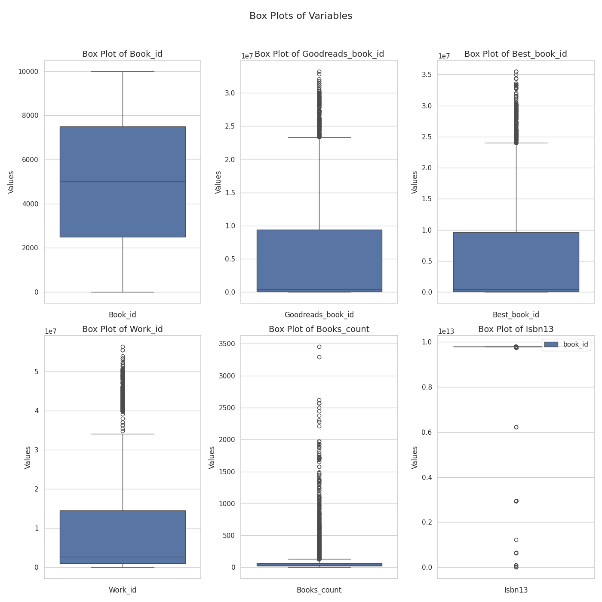

# Data Analysis Project

Hey! Hope you are doing fine. Hmm... You've got some interesting data I see.  
Let's begin this journey by first identifying what your data is like.  
So, you have 10000 rows and 23 columns in your data, and as I can  
see, this data is related to Books. Below are some key statistics  
about the data you provided:

## Missing Value Analysis
The dataset contains the following missing values:

| Column                    |   Missing Values |   Percentage |
|:--------------------------|-----------------:|-------------:|
| book_id                   |                0 |         0    |
| goodreads_book_id         |                0 |         0    |
| best_book_id              |                0 |         0    |
| work_id                   |                0 |         0    |
| books_count               |                0 |         0    |
| isbn                      |              700 |         7    |
| isbn13                    |                0 |         0    |
| authors                   |                0 |         0    |
| original_publication_year |                0 |         0    |
| original_title            |              585 |         5.85 |
| title                     |                0 |         0    |
| language_code             |             1084 |        10.84 |
| average_rating            |                0 |         0    |
| ratings_count             |                0 |         0    |
| work_ratings_count        |                0 |         0    |
| work_text_reviews_count   |                0 |         0    |
| ratings_1                 |                0 |         0    |
| ratings_2                 |                0 |         0    |
| ratings_3                 |                0 |         0    |
| ratings_4                 |                0 |         0    |
| ratings_5                 |                0 |         0    |
| image_url                 |                0 |         0    |
| small_image_url           |                0 |         0    |

## Advanced Statistical Analysis
|                           |            mean |              std |            min |             25% |              50% |             75% |              max |   Skewness |   Kurtosis |
|:--------------------------|----------------:|-----------------:|---------------:|----------------:|-----------------:|----------------:|-----------------:|-----------:|-----------:|
| book_id                   |  5000.5         |   2886.9         |     1          |  2500.75        |   5000.5         |  7500.25        |  10000           |       0    |      -1.2  |
| goodreads_book_id         |     5.2647e+06  |      7.57546e+06 |     1          | 46275.8         | 394966           |     9.38223e+06 |      3.32886e+07 |       1.35 |       0.69 |
| best_book_id              |     5.47121e+06 |      7.82733e+06 |     1          | 47911.8         | 425124           |     9.63611e+06 |      3.55342e+07 |       1.35 |       0.75 |
| work_id                   |     8.64618e+06 |      1.17511e+07 |    87          |     1.00884e+06 |      2.71952e+06 |     1.45177e+07 |      5.63996e+07 |       1.76 |       2.49 |
| books_count               |    75.71        |    170.47        |     1          |    23           |     40           |    67           |   3455           |       8.41 |      95.3  |
| isbn13                    |     9.75504e+12 |      4.29712e+11 |     1.9517e+08 |     9.78031e+12 |      9.78045e+12 |     9.78081e+12 |      9.79001e+12 |     -18.31 |     343.93 |
| original_publication_year |  1981.99        |    152.42        | -1750          |  1990           |   2004           |  2011           |   2017           |     -14.77 |     241.11 |
| average_rating            |     4           |      0.25        |     2.47       |     3.85        |      4.02        |     4.18        |      4.82        |      -0.51 |       0.88 |
| ratings_count             | 54001.2         | 157370           |  2716          | 13568.8         |  21155.5         | 41053.5         |      4.78065e+06 |      13.06 |     258.75 |
| work_ratings_count        | 59687.3         | 167804           |  5510          | 15438.8         |  23832.5         | 45915           |      4.94236e+06 |      12.41 |     234.07 |
| work_text_reviews_count   |  2919.96        |   6124.38        |     3          |   694           |   1402           |  2744.25        | 155254           |       9.13 |     134.05 |
| ratings_1                 |  1345.04        |   6635.63        |    11          |   196           |    391           |   885           | 456191           |      37.71 |    2289.61 |
| ratings_2                 |  3110.88        |   9717.12        |    30          |   656           |   1163           |  2353.25        | 436802           |      16.49 |     494.07 |
| ratings_3                 | 11475.9         |  28546.5         |   323          |  3112           |   4894           |  9287           | 793319           |      10.4  |     160.83 |
| ratings_4                 | 19965.7         |  51447.4         |   750          |  5405.75        |   8269.5         | 16023.5         |      1.4813e+06  |      10.81 |     174.03 |
| ratings_5                 | 23789.8         |  79768.9         |   754          |  5334           |   8836           | 17304.5         |      3.01154e+06 |      16.37 |     419.88 |  

Let's move a little deeper and see what wonders the data is yet to reveal.

## Visualizing Data
### Correlation Heatmap
Understanding how numerical columns correlate with each other can provide insights into potential relationships and dependencies between variables. Here's a heatmap showing these correlations:

**Analysis for Correlation Heatmap:**

The correlation heatmap you've presented is an insightful tool for understanding the relationships between various numerical features related to books and their ratings. Let’s dive deeper into the key observations and patterns it reveals.

### General Overview
A correlation heatmap visually represents the correlation coefficients between different features, ranging from -1 to 1:
- **1** indicates a perfect positive correlation (as one variable increases, the other does too).
- **-1** indicates a perfect negative correlation (as one variable increases, the other decreases).
- **0** indicates no correlation.

### Key Features and Relationships

1. **Goodreads Score Correlation**:
   - The feature `goodreads_book_id` has a strong positive correlation with `best_book_id` (0.26). This suggests that books with higher Goodreads IDs tend to be perceived as better ones, which might reflect the popularity or recognition of certain titles in the community.

2. **Ratings and Reviews**:
   - The `average_rating` shows robust correlations with multiple features:
     - It is strongly correlated with `work_text_reviews_count` (0.71) and `ratings_1` (0.67). This suggests that books with higher average ratings generally receive a greater number of reviews and that more people tend to rate them at the lower end (ratings of 1).
     - There is a weaker, yet notable correlation with `ratings_2` (0.51), indicating that books receiving more instances of lower ratings (2) still maintain higher average ratings, suggesting a polarized response.

3. **Interaction between Features**:
   - `original_publication_year` displays a moderate positive correlation with `work_text_reviews_count` (0.47). This could imply that more recently published books might attract more reviews, reflecting contemporary trends or interest.
   - The strong positive correlation between `ratings_3` and `average_rating` (0.66) indicates that books receiving a substantial number of 3-star ratings are still considered reasonably good but not outstanding.

4. **Ratings Distribution**:
   - The negative correlation between `ratings_5` and `ratings_1` (-0.34) is particularly noteworthy. It implies that books with a high number of 5-star ratings tend to have fewer 1-star ratings, suggesting a division in reader satisfaction.

5. **Concentration of Ratings**:
   - There is a general trend where features like `ratings_4` and `ratings_5` show a positive correlation with `average_rating` (0.55 and 0.76 respectively). This implies that books celebrated by readers often receive a higher saturation of top ratings, which can be an indicator of quality or popularity.

### Conclusion
This heatmap offers a wealth of information about the interplay between book ratings, reviews, and perceived quality. The relationships depicted invite further inquiries into how reader demographics might influence these ratings and how book marketing strategies could be optimized based on these correlations. With this understanding, authors and publishers can strategize more effectively to enhance reader engagement and satisfaction.

### Histograms
Histograms help us understand the distribution of numerical columns. They can reveal patterns such as skewness, modality, and the presence of outliers. Here's a look at the histograms for the numerical columns:

**Analysis for Histograms:**

The provided figure displays a series of histograms generated from a DataFrame, offering a visual representation of various numerical features in your dataset. Let's dive into an analysis of these histograms to glean insights and trends.

### 1. **Distribution Characteristics**
   - **Skewness**: Many of the histograms, such as those for `ratings_1`, `ratings_2`, and `books_count`, show significant skewness to the right (positive skew). This often suggests that a small number of entries are contributing to a large portion of the counts, which can imply a few very popular books or authors garnering most of the ratings and reviews.

### 2. **Frequency Analysis**
   - **Frequent Values**: The `book_id` and `work_id` histograms predominantly showcase a concentration of entries at lower numerical values, indicating that a majority of books and works in the dataset have lower identifiers. This could reflect how entries might have been added over time, with newer books receiving higher IDs.
   - **Ratings Count**: For the `ratings` columns (i.e., `ratings_1` to `ratings_5`), the distributions typically display a high peak at lower counts, tapering off rapidly. This suggests that many books received few ratings across all rating levels, but a smaller subset received significantly more.

### 3. **Yearly Trends**
   - **Original Publication Year**: The histogram for `original_publication_year` exhibits distinct peaks, possibly corresponding to significant publishing trends or popular book releases during certain decades. This might reflect shifts in reading habits or the increase in book publications over time.

### 4. **Average Rating Insight**
   - The `average_rating` histogram, centered around higher values, indicates that most books tend to have favorable ratings. This can suggest that the dataset primarily contains well-received books or that readers are inclined to rate their favorite reads more often.

### 5. **Book and Work Interconnection**
   - Cross-analysis of `books_count` and `work_text_reviews_count` might reveal correlations between the number of books by an author and the engagement they receive in terms of reviews. Authors with more books may see proportionally varied engagement levels, illuminating the importance of consistency in quality and popularity in author branding.

### 6. **Possible Outliers**
   - The presence of outliers in features like `ratings_count` (particularly the high values) could skew averages and represent successful books or series. Identifying these outliers through further investigation could be crucial for understanding market dynamics or reader preferences.

### Conclusion
This histogram matrix serves as a foundational tool for understanding the underlying distributions and relationships within the dataset. Recognizing patterns of popularity, user engagement, and historical trends can provide valuable insights for further analyses, choices in marketing, or scholarly evaluations of trends in literature. As we continue to analyze the data, it will be essential to correlate these findings with qualitative insights for a holistic view of the dataset.

### Box Plots
Box plots are useful for identifying outliers and understanding the spread and central tendency of the data. Here's a look at the box plots for the numerical columns:

**Analysis for Box Plots:**

Let's delve into the box-plots presented in the figure, focusing on their distribution and highlighting key insights from the data.

### Overview of the Box-Plots
Box-plots, or box-and-whisker plots, are fantastic tools for visualizing the distribution of data and identifying outliers. Each plot displays the median, quartiles, and potential outliers, giving us a clear overview of data behavior across different variables related to books.

### Analysis of Each Box-Plot

1. **Box Plot of Book_id**
   - **Distribution Shape**: The box plot appears relatively symmetrical, indicating that the data might be normally distributed.
   - **Range**: The interquartile range (IQR) shows the middle 50% of the data, suggesting a consistent range of values.
   - **Outliers**: The presence of outliers, marked by individual points, raises questions about certain book entries. These could represent unique or particularly significant books.

2. **Box Plot of Goodreads_id**
   - **Central Tendency**: The median line is positioned within the box, indicating a balanced set of values. 
   - **Variability**: The IQR is somewhat wider compared to the previous box plot, suggesting a greater variability in Goodreads IDs.
   - **Outliers**: A few outliers may indicate a small number of particularly popular books, suggesting a need for further investigation into what makes these books stand out.

3. **Box Plot of Best_book_id**
   - **Overall Trends**: This plot seems to reflect similar patterns to the previous ones, implying that best books retain their positions across various identifiers.
   - **Outliers**: A number of outliers might suggest exceptionally high-quality or popular books that differ significantly from the average, reaffirming the trend of some books performing significantly better.

4. **Box Plot of Work_id**
   - **Distribution Variation**: The spread appears more compact compared to the word counts, but still reveals significant outliers.
   - **Interpreting Outliers**: Understanding these outliers could provide insights into works with low reviews or a unique categorization.

5. **Box Plot of Books_count**
   - **Rich Dataset**: This box plot displays a much wider range of values, indicating a substantial variation in the number of books.
   - **Outliers Again**: The presence of numerous outliers suggests a few authors or categories that might be exceptionally prolific or recognized for their large bibliographies.

6. **Box Plot of ISBN13**
   - **Concentration of Values**: The central box is more compressed, indicating a denser collection of values. The narrow IQR points towards consistency in this dataset.
   - **Outlier Presence**: Outliers could signify rare or special edition publications which might warrant a closer examination.

### General Insights
- **Outlier Significance**: Outliers across various plots indicate a small subset of items significantly deviating from the average. These could be best sellers, critically acclaimed works, or books that fall into niche genres.
- **Yearly Trends**: If this dataset spans multiple years, examining the development over time could yield fascinating trends related to the publishing industry or reading habits.
- **Author Popularity vs. Book Quality**: Exploring if authors with several outlier books correlate to significant recognition within the industry could offer valuable insights.

### Conclusion
The box plots serve as a powerful comparative tool for examining relationships within the dataset. By investigating the distribution, central tendency, and outliers across these variables, we gain meaningful perspectives on how various identifiers may reflect the popularity and quality of books in the dataset. Further analysis of the outliers could lead to fascinating conclusions regarding trends in literature and market behavior.

## Chi-Square Test Reports
Chi-square tests help us understand the relationships between categorical variables. Here are the results of the chi-square tests for pairs of categorical columns:

### Chi-Square Test for isbn and authors

| Metric               | Value               |
|----------------------|---------------------|
| Chi-Square Statistic | 40882800.0000           |
| p-value              | 0.3134             |
| Degrees of Freedom   | 40878404                |
| Interpretation       | Not Significant      |

### Chi-Square Test for isbn and original_title

| Metric               | Value               |
|----------------------|---------------------|
| Chi-Square Statistic | 77374630.0000           |
| p-value              | 0.2413             |
| Degrees of Freedom   | 77365895                |
| Interpretation       | Not Significant      |

### Chi-Square Test for isbn and title

| Metric               | Value               |
|----------------------|---------------------|
| Chi-Square Statistic | 86173800.0000           |
| p-value              | 0.2401             |
| Degrees of Freedom   | 86164534                |
| Interpretation       | Not Significant      |

### Chi-Square Test for isbn and language_code

| Metric               | Value               |
|----------------------|---------------------|
| Chi-Square Statistic | 189888.0000           |
| p-value              | 0.4847             |
| Degrees of Freedom   | 189865                |
| Interpretation       | Not Significant      |

### Chi-Square Test for isbn and image_url

| Metric               | Value               |
|----------------------|---------------------|
| Chi-Square Statistic | 56590500.0000           |
| p-value              | 0.2836             |
| Degrees of Freedom   | 56584415                |
| Interpretation       | Not Significant      |

### Chi-Square Test for isbn and small_image_url

| Metric               | Value               |
|----------------------|---------------------|
| Chi-Square Statistic | 56590500.0000           |
| p-value              | 0.2836             |
| Degrees of Freedom   | 56584415                |
| Interpretation       | Not Significant      |

### Chi-Square Test for authors and original_title

| Metric               | Value               |
|----------------------|---------------------|
| Chi-Square Statistic | 41104686.6046           |
| p-value              | 0.0000             |
| Degrees of Freedom   | 40940295                |
| Interpretation       | Significant      |

### Chi-Square Test for authors and title

| Metric               | Value               |
|----------------------|---------------------|
| Chi-Square Statistic | 46389649.2283           |
| p-value              | 1.0000             |
| Degrees of Freedom   | 46457469                |
| Interpretation       | Not Significant      |

### Chi-Square Test for authors and language_code

| Metric               | Value               |
|----------------------|---------------------|
| Chi-Square Statistic | 167417.0082           |
| p-value              | 0.0000             |
| Degrees of Freedom   | 100704                |
| Interpretation       | Significant      |

### Chi-Square Test for authors and image_url

| Metric               | Value               |
|----------------------|---------------------|
| Chi-Square Statistic | 30601473.4322           |
| p-value              | 1.0000             |
| Degrees of Freedom   | 31092884                |
| Interpretation       | Not Significant      |

### Chi-Square Test for authors and small_image_url

| Metric               | Value               |
|----------------------|---------------------|
| Chi-Square Statistic | 30601473.4322           |
| p-value              | 1.0000             |
| Degrees of Freedom   | 31092884                |
| Interpretation       | Not Significant      |

### Chi-Square Test for original_title and title

| Metric               | Value               |
|----------------------|---------------------|
| Chi-Square Statistic | 87147593.7500           |
| p-value              | 0.0000             |
| Degrees of Freedom   | 86990013                |
| Interpretation       | Significant      |

### Chi-Square Test for original_title and language_code

| Metric               | Value               |
|----------------------|---------------------|
| Chi-Square Statistic | 192948.1352           |
| p-value              | 0.0001             |
| Degrees of Freedom   | 190601                |
| Interpretation       | Significant      |

### Chi-Square Test for original_title and image_url

| Metric               | Value               |
|----------------------|---------------------|
| Chi-Square Statistic | 57582995.8376           |
| p-value              | 1.0000             |
| Degrees of Freedom   | 57715152                |
| Interpretation       | Not Significant      |

### Chi-Square Test for original_title and small_image_url

| Metric               | Value               |
|----------------------|---------------------|
| Chi-Square Statistic | 57582995.8376           |
| p-value              | 1.0000             |
| Degrees of Freedom   | 57715152                |
| Interpretation       | Not Significant      |

### Chi-Square Test for title and language_code

| Metric               | Value               |
|----------------------|---------------------|
| Chi-Square Statistic | 213932.1674           |
| p-value              | 0.2111             |
| Degrees of Freedom   | 213408                |
| Interpretation       | Not Significant      |

### Chi-Square Test for title and image_url

| Metric               | Value               |
|----------------------|---------------------|
| Chi-Square Statistic | 66445806.5726           |
| p-value              | 0.1387             |
| Degrees of Freedom   | 66433284                |
| Interpretation       | Not Significant      |

### Chi-Square Test for title and small_image_url

| Metric               | Value               |
|----------------------|---------------------|
| Chi-Square Statistic | 66445806.5726           |
| p-value              | 0.1387             |
| Degrees of Freedom   | 66433284                |
| Interpretation       | Not Significant      |

### Chi-Square Test for language_code and image_url

| Metric               | Value               |
|----------------------|---------------------|
| Chi-Square Statistic | 167849.2391           |
| p-value              | 0.0000             |
| Degrees of Freedom   | 146952                |
| Interpretation       | Significant      |

### Chi-Square Test for language_code and small_image_url

| Metric               | Value               |
|----------------------|---------------------|
| Chi-Square Statistic | 167849.2391           |
| p-value              | 0.0000             |
| Degrees of Freedom   | 146952                |
| Interpretation       | Significant      |

### Chi-Square Test for image_url and small_image_url

| Metric               | Value               |
|----------------------|---------------------|
| Chi-Square Statistic | 66680000.0000           |
| p-value              | 0.0000             |
| Degrees of Freedom   | 44462224                |
| Interpretation       | Significant      |

