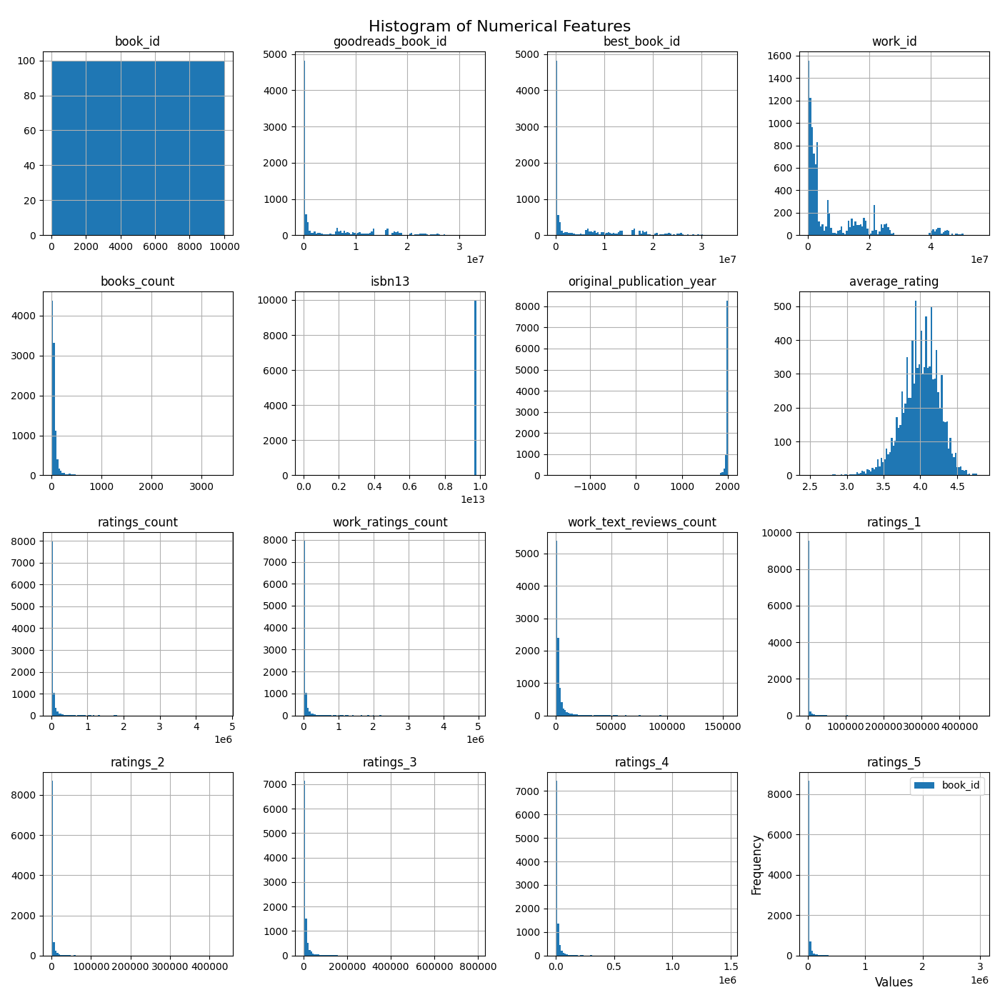

# Data Analysis Project 
Hey! Hope you are doing fine. Hmm... You've got some interesting data I  
see. Let's begin this journey with fist identifying what your data is like.  
So, you have got 10000 rows and 23 columns in your data and  
as I can see this data this data is related to Books. Below are some key  
statistics about the data you provided

## Key Statistics
|       |   book_id |   goodreads_book_id |     best_book_id |         work_id |   books_count |         isbn13 |   original_publication_year |   average_rating |    ratings_count |   work_ratings_count |   work_text_reviews_count |   ratings_1 |   ratings_2 |   ratings_3 |      ratings_4 |       ratings_5 |
|:------|----------:|--------------------:|-----------------:|----------------:|--------------:|---------------:|----------------------------:|-----------------:|-----------------:|---------------------:|--------------------------:|------------:|------------:|------------:|---------------:|----------------:|
| count |     10000 |     10000           |  10000           | 10000           |         10000 | 9415           |                        9979 |            10000 |  10000           |      10000           |                     10000 |       10000 |       10000 |       10000 | 10000          | 10000           |
| mean  |      5000 |         5.2647e+06  |      5.47121e+06 |     8.64618e+06 |            75 |    9.75504e+12 |                        1981 |                4 |  54001           |      59687           |                      2919 |        1345 |        3110 |       11475 | 19965          | 23789           |
| std   |      2886 |         7.57546e+06 |      7.82733e+06 |     1.17511e+07 |           170 |    4.42862e+11 |                         152 |                0 | 157369           |     167803           |                      6124 |        6635 |        9717 |       28546 | 51447          | 79768           |
| min   |         1 |         1           |      1           |    87           |             1 |    1.9517e+08  |                       -1750 |                2 |   2716           |       5510           |                         3 |          11 |          30 |         323 |   750          |   754           |
| 25%   |      2500 |     46275           |  47911           |     1.00884e+06 |            23 |    9.78032e+12 |                        1990 |                3 |  13568           |      15438           |                       694 |         196 |         656 |        3112 |  5405          |  5334           |
| 50%   |      5000 |    394965           | 425123           |     2.71952e+06 |            40 |    9.78045e+12 |                        2004 |                4 |  21155           |      23832           |                      1402 |         391 |        1163 |        4894 |  8269          |  8836           |
| 75%   |      7500 |         9.38222e+06 |      9.63611e+06 |     1.45177e+07 |            67 |    9.78083e+12 |                        2011 |                4 |  41053           |      45915           |                      2744 |         885 |        2353 |        9287 | 16023          | 17304           |
| max   |     10000 |         3.32886e+07 |      3.55342e+07 |     5.63996e+07 |          3455 |    9.79001e+12 |                        2017 |                4 |      4.78065e+06 |          4.94236e+06 |                    155254 |      456191 |      436802 |      793319 |     1.4813e+06 |     3.01154e+06 |  
  
Let's move a little deeper and see what wonders the data is yet to reveal.
  
## Visualizing Data
Let's see how numerical columns correlate with each other  
  

  
As we delve into the realm of literary connections through our correlation heatmap, a narrative begins to unfold. Picture a world where the influence of each book is interconnected, revealing a tapestry woven from reader engagement and appreciation.

At the center of our exploration, we find the **average_rating** and **ratings_count**. They stand as robust pillars, jointly illuminating the preferences of readers. A notable positive correlation (0.82) hints at a harmonious relationship: as the average rating climbs, so too does the number of ratings, suggesting that highly regarded books attract more attention and love from readers.

Moving outward, we encounter the **original_publication_year**, which reveals a fascinating tale. Its moderate negative correlation (-0.32) with **average_rating** suggests that older publications, while cherished, may not resonate as strongly in contemporary discussions or reviews. This invites us to ponder how times change, and what once was a favorite can fade into obscurity.

Complex patterns emerge as we analyze **work_text_reviews_count** and its relationships. Here, a positive correlation (0.71) with **average_rating** indicates that books receiving more reviews generally earn higher ratings, possibly reflecting the engagement and dialogue they inspire among readers.

Conversely, we observe intriguing dynamics with specific **ratings** features—ratings 1 through 5. The data whispers stories of reader satisfaction and dissent, where negative ratings (ratings_1 and ratings_2) inversely correlate with the average rating, portraying the impact of polarized opinions.

Ultimately, this heatmap serves as a mirror, reflecting the intricate ties between literary works and reader interactions. Each correlation paints a part of the story, encouraging us to delve deeper into the motivations behind ratings and the timeless connection books forge among individuals. Through this analysis, we become treasure hunters, seeking to unearth the nuances that lie beneath the surface of numbers, creating a richer understanding of our literary landscape. 

Now in the second figure we'll see numerical columns spread themselves.  
  

  
In a quiet corner of the literary world, a tapestry of data unfolds, encapsulating the wonders of reading through histograms derived from a dataset of books. 

At first glance, the canvas reveals a variety of distributions, each telling its own tale. The histogram for **book_id** stands out with a curious cluster of values, suggesting a limited selection among an extensive catalog—perhaps some books are more prevalent than others. Nearby, **goodreads_book_id** mirrors this trend, hinting at similar popularity patterns driven by community engagement.

Turning to **best_book_id**, a striking peak emerges, showcasing that a select few titles dominate the accolades. This suggests that while many books are published, only a handful truly capture readers’ hearts.

The **work_id** histogram brims with life, as its broad distribution illustrates the extensive body of work represented—each entry a potential journey into different worlds. Meanwhile, **books_count** and **ratings_count** offer a glimpse into the abundance of opinions, where more books lead to a rich tapestry of reader experiences.

**original_publication_year** paints a historical context, featuring a noticeable concentration of works from certain eras—perhaps reflecting the ebb and flow of literary trends over the decades. 

Among the more nuanced narratives, **average_rating** unveils a curve inclined towards higher evaluations, resonating with an audience who seems to favor certain literary gems. The ratings from **ratings_1** to **ratings_5** present a compelling sequence; numbers suggest a divergence in reader satisfaction, with a dominant spike in higher ratings, indicating a generally positive reception of books.

As we step back, the histograms coalesce into a story—a visual symphony of numbers and values, intricately linked to the vibrant world of literature. Each histogram, a chapter filled with insights, reveals not just the popularity of books but the ever-changing landscape of reader preferences and trends. In this blend of data, we find the essence of storytelling, where numbers breathe life into the tales behind each title.

Lastly, we'll see some mischievous datapoints that don't follow the trend (Outliers!).  
  

  
Once upon a time in the realm of books, we found ourselves exploring a series of box plots that unveiled the hidden stories within various metrics of the literary world. 

In the first corner, the generous box showing "Book_id" revealed a vast range of book identifiers, highlighting the immense diversity in literature. However, nestled within that box lay a few outliers—those rare gems that stood apart from the crowd. 

Next, the "Goodreads_Goodreads_id" box plot echoed a similar tale. Its box width indicated a broad spread of entries, but a number of outliers hinted at unique books that sparked more discussions than others, possibly beloved novels or controversial reads.

Moving to the "Best_book_id," it was intriguing to see a more compact central box, suggesting that the 'best' books converged around a select few yet again contained those fascinating outliers—books that perhaps captured the hearts of a few but not the masses.

The "Work_id" plot told of a labor of love, with a wider spread implying a plethora of work types, while outliers stood as testaments to particularly prolific authors who managed to publish a staggering number of works.

As we turned to “Books_count,” we noticed a rise in median values, indicating that many authors are creating more than just a single tale. Yet, just like the other plots, that presence of outliers signified those rare authors whose libraries overflowed with creativity.

Finally, the "isbn13" box plot brought us back to the core of book identification. The box was again broad, but the most fascinating aspect was the outliers—those mysterious books that somehow slipped through the cracks of conventional indexing.

Through these visuals, we traveled across the expanse of literary data, uncovering the unseen stories hidden within the metrics of books, authors, and their contributions to the world of literature. Each box plot told a story of its own, reminding us how diverse and rich the literary landscape truly is.

