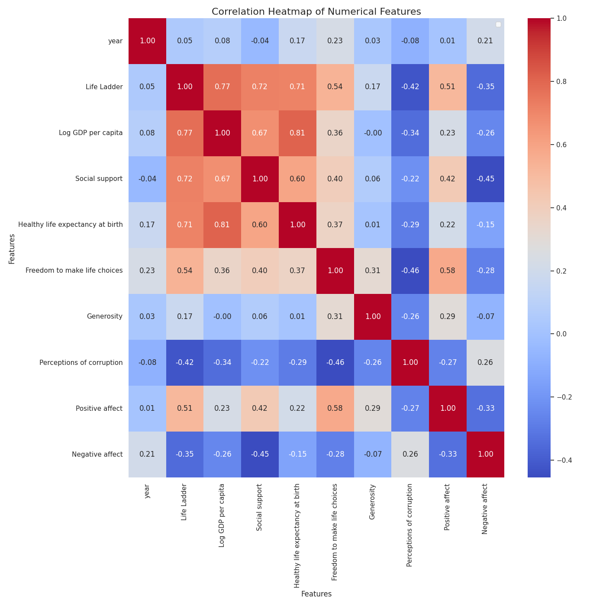
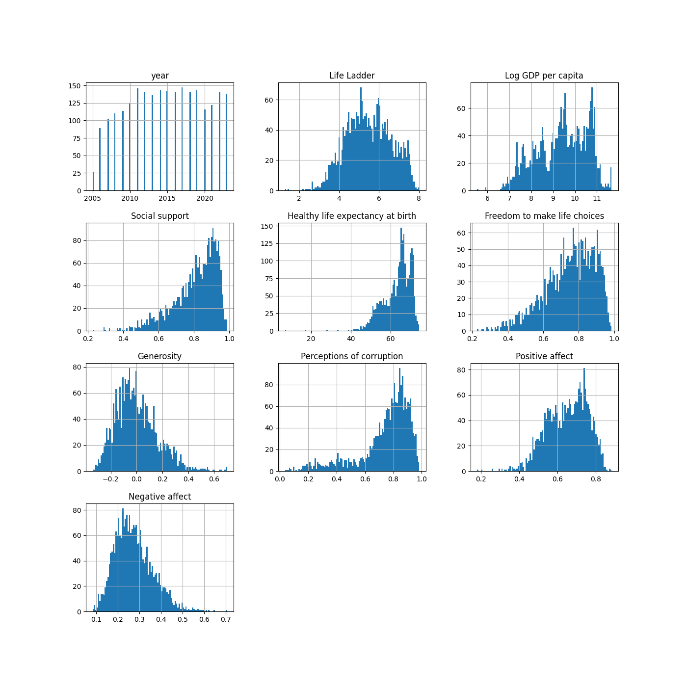
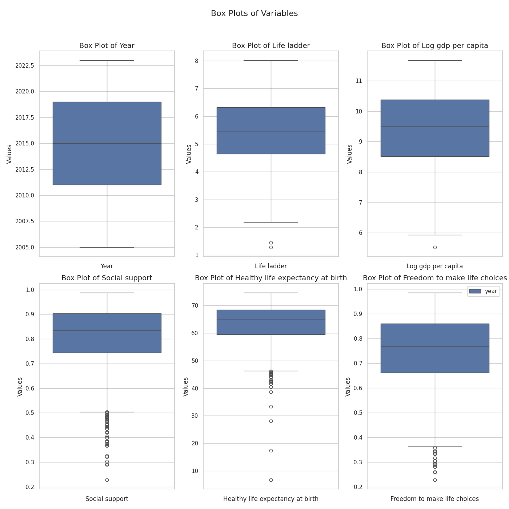

# Data Analysis Project

Hey! Hope you are doing fine. Hmm... You've got some interesting data I see.  
Let's begin this journey by first identifying what your data is like.  
So, you have 2363 rows and 11 columns in your data, and as I can  
see, this data is related to Wellbeing. Below are some key statistics  
about the data you provided:

## Missing Value Analysis
The dataset contains the following missing values:

| Column                           |   Missing Values |   Percentage |
|:---------------------------------|-----------------:|-------------:|
| Country name                     |                0 |            0 |
| year                             |                0 |            0 |
| Life Ladder                      |                0 |            0 |
| Log GDP per capita               |                0 |            0 |
| Social support                   |                0 |            0 |
| Healthy life expectancy at birth |                0 |            0 |
| Freedom to make life choices     |                0 |            0 |
| Generosity                       |                0 |            0 |
| Perceptions of corruption        |                0 |            0 |
| Positive affect                  |                0 |            0 |
| Negative affect                  |                0 |            0 |

## Advanced Statistical Analysis
|                                  |    mean |   std |     min |     25% |     50% |     75% |     max |   Skewness |   Kurtosis |
|:---------------------------------|--------:|------:|--------:|--------:|--------:|--------:|--------:|-----------:|-----------:|
| year                             | 2014.76 |  5.06 | 2005    | 2011    | 2015    | 2019    | 2023    |      -0.06 |      -1.09 |
| Life Ladder                      |    5.48 |  1.13 |    1.28 |    4.65 |    5.45 |    6.32 |    8.02 |      -0.05 |      -0.56 |
| Log GDP per capita               |    9.4  |  1.15 |    5.53 |    8.52 |    9.49 |   10.38 |   11.68 |      -0.34 |      -0.75 |
| Social support                   |    0.81 |  0.12 |    0.23 |    0.74 |    0.83 |    0.9  |    0.99 |      -1.11 |       1.15 |
| Healthy life expectancy at birth |   63.4  |  6.75 |    6.72 |   59.54 |   64.9  |   68.4  |   74.6  |      -1.15 |       3.09 |
| Freedom to make life choices     |    0.75 |  0.14 |    0.23 |    0.66 |    0.77 |    0.86 |    0.98 |      -0.71 |       0.1  |
| Generosity                       |    0    |  0.16 |   -0.34 |   -0.11 |   -0.02 |    0.09 |    0.7  |       0.78 |       0.97 |
| Perceptions of corruption        |    0.74 |  0.18 |    0.04 |    0.7  |    0.79 |    0.86 |    0.98 |      -1.53 |       2.08 |
| Positive affect                  |    0.65 |  0.11 |    0.18 |    0.57 |    0.66 |    0.74 |    0.88 |      -0.46 |      -0.12 |
| Negative affect                  |    0.27 |  0.09 |    0.08 |    0.21 |    0.26 |    0.33 |    0.7  |       0.7  |       0.66 |  

Let's move a little deeper and see what wonders the data is yet to reveal.

## Visualizing Data
### Correlation Heatmap
Understanding how numerical columns correlate with each other can provide insights into potential relationships and dependencies between variables. Here's a heatmap showing these correlations:

**Analysis for Correlation Heatmap:**

### Detailed Analysis of the Correlation Heatmap

The correlation heatmap visualizes the relationships between various numerical features that can impact overall well-being and social factors. Each cell in the heatmap represents the correlation coefficient (ranging from -1 to 1) between pairs of features, where:

- **1** indicates a perfect positive correlation,
- **-1** indicates a perfect negative correlation,
- **0** indicates no correlation.

#### Key Features and Their Interactions

1. **Year**:
   - The "year" attribute shows moderate positive correlations with almost all other variables, suggesting a trend where improvement in well-being indicators may be associated with more recent data. Notably, it has the strongest correlation with "Life Ladder" (0.77), indicating a possible connection between the year's progression and subjective life satisfaction.

2. **Life Ladder**:
   - This metric, often used as a measure of life satisfaction, has significant positive correlations with several other features:
     - **Log GDP per capita (0.72)**: As the economic status of a region improves, life satisfaction tends to increase.
     - **Healthy life expectancy at birth (0.67)**: There's a clear relationship between longer expected health and higher life satisfaction.
     - **Freedom to make life choices (0.61)**: Autonomy in making personal choices contributes positively to perceived life quality.
   - Conversely, it has a moderate negative correlation with "Negative affect" (-0.44), reinforcing the idea that greater life satisfaction often corresponds with lower levels of negative emotions.

3. **Log GDP per Capita**:
   - This variable shows a strong association with "Life Ladder" and "Healthy life expectancy," indicating that economic growth is positively linked to both life satisfaction and overall health. Interestingly, it exhibits a weaker connection with "Generosity" (0.12) and "Negative affect" (-0.35), suggesting that richer nations may not necessarily foster widespread charitable behaviors.

4. **Healthy Life Expectancy at Birth**:
   - Strongly correlates with life satisfaction metrics (0.67) and positive emotional states (positive affect: 0.51). This implies that regions with better health infrastructure or medical outcomes contribute to higher life quality perceptions.

5. **Freedom to Make Life Choices**:
   - The positive correlation (0.61) with the life ladder underlines the importance of personal autonomy in influencing well-being. It has a modest negative correlation with "Negative affect" (-0.30), suggesting that restricted choices could lead to increased distress.

6. **Generosity**:
   - Surprisingly, correlation with life satisfaction is relatively low (0.08), reflecting a possible complexity where charitable behaviors do not directly influence happiness levels. It does have a correlation with "Perceptions of corruption" (-0.31), indicating that higher corruption levels may deter acts of generosity.

7. **Perceptions of Corruption**:
   - Demonstrates noteworthy negative correlations with "Generosity" (-0.31) and "Life Ladder" (-0.41), emphasizing that corruption can erode trust and social capital, ultimately diminishing life satisfaction.

8. **Positive and Negative Affect**:
   - There's a strong negative correlation between positive and negative affect (-0.83), underscoring the common psychological premise that joy and sorrow are often inversely related. Positive affect has significant correlations with "Life Ladder" (0.66) and "Healthy life expectancy" (0.51), suggesting that happiness is interlinked with health and overall life satisfaction.

### Conclusion

This correlation heatmap captures the nuanced interplay among various dimensions of well-being, highlighting the significant roles of economic prosperity, health, political freedom, and emotional states. Such insights can assist policymakers in designing better interventions aimed at improving quality of life by focusing on economic, health, and social liberties as interdependent factors. Understanding these correlations enables a holistic approach to fostering happiness and well-being in society.

### Histograms
Histograms help us understand the distribution of numerical columns. They can reveal patterns such as skewness, modality, and the presence of outliers. Here's a look at the histograms for the numerical columns:

**Analysis for Histograms:**

The histograms presented in this figure offer a comprehensive view of the distributions of various numerical features from the dataset. Let's analyze each variable in detail:

### 1. Life Ladder
- **Distribution**: It appears to be slightly skewed to the right, with most values clustering around the middle (5-7), indicating a general sense of well-being among populations.
- **Insight**: This suggests that while many populations report a moderate to high quality of life, there are outliers with very high life satisfaction scores.

### 2. Log GDP per capita
- **Distribution**: The histogram reveals a prominent peak around 10, with a rightward tail suggesting the presence of higher-income countries.
- **Insight**: The log transformation implies that while most economies are around average or below, a few outliers are significantly wealthier, highlighting income inequality globally.

### 3. Social Support
- **Distribution**: This feature shows a relatively high concentration of scores around 0.8 to 1, indicating that many individuals feel they have social support.
- **Insight**: High levels of perceived social support can be correlated with better mental health and overall life satisfaction, reflecting cultural factors in social cohesion.

### 4. Healthy Life Expectancy at Birth
- **Distribution**: The values are clustered toward the higher end (around 70-80 years), but there is a noticeable spread, with some individuals reporting lower life expectancies.
- **Insight**: This reflects the variation in healthcare quality and social conditions across different regions.

### 5. Freedom to Make Life Choices
- **Distribution**: The distribution is slightly skewed right, with many falling between 0.6 and 0.9, but some deviations indicate a lack of freedom among certain populations.
- **Insight**: This highlights the impact of political and social climates on individuals' perceived freedom, which can greatly affect overall happiness.

### 6. Generosity
- **Distribution**: The histogram shows a peak at lower scores, indicating a general tendency toward lower reported generosity rates.
- **Insight**: This might suggest economic constraints or cultural factors that influence how people perceive and engage in generosity.

### 7. Perceptions of Corruption
- **Distribution**: This feature also peaks at the lower end, suggesting widespread beliefs in high levels of corruption.
- **Insight**: A prevalent perception of corruption may undermine trust in institutions, affecting overall happiness and societal well-being.

### 8. Positive Affect
- **Distribution**: Concentrated around higher values but the presence of some lower scores reveals variability in emotional well-being.
- **Insight**: Higher positive affect is generally linked to better mental health, suggesting that various factors, including socioeconomic conditions, play a role in emotional experiences.

### 9. Negative Affect
- **Distribution**: This feature shows a skew towards lower values but with a noticeable spread indicating some individuals experience higher levels of negative emotions.
- **Insight**: This disparity can point to stressors in certain populations, such as economic hardship or social instability, that adversely affect emotional health.

### Overall Observations
- **Skewness & Kurtosis**: Many of the distributions exhibit skewness (especially Life Ladder, Log GDP, and Positive Affect), revealing the complexity of human experiences across demographics.
- **Interconnections**: The relationships between these variables are likely interconnected; for instance, higher GDP might correlate with better perceptions of social support and lower levels of corruption.
- **Cultural Context**: The data may suggest significant cultural and socioeconomic factors driving these statistics, implying a need for targeted interventions to boost well-being across various populations.

### Conclusion
These histograms encapsulate the nuanced landscape of human well-being, urging further exploration into how these factors interplay and impact overall happiness. Such analysis can inform policymakers and researchers as they strive to improve quality of life globally.

### Box Plots
Box plots are useful for identifying outliers and understanding the spread and central tendency of the data. Here's a look at the box plots for the numerical columns:

**Analysis for Box Plots:**

### Detailed Analysis of the Box-Plots

Box plots are powerful tools for visualizing the distribution of data, highlighting key statistical insights such as central tendency, variability, and the presence of outliers. Let’s delve into each of the displayed box plots and uncover interesting findings.

#### Box Plot of Year
- **Interpretation**: The years range from approximately 2005 to 2022, with a fairly even distribution.
- **Observations**: The central line within the box may represent the median year (likely around 2015), which gives us a temporal reference point.
- **Insight**: This plot helps contextualize the trends in subsequent variables over time, showing how data sets evolve.

#### Box Plot of Life Ladder
- **Interpretation**: The Life Ladder score varies significantly, indicating disparate perceptions of well-being among respondents.
- **Observations**: The median appears just above 5, suggesting that most individuals rate their life satisfaction around the middle of the scale.
- **Insight**: The presence of outliers may indicate unique cases of exceptional life satisfaction or notable hardship, prompting a deeper exploration of those specific data points.

#### Box Plot of Log GDP per Capita
- **Interpretation**: This plot reflects economic well-being, with scores likely ranging from lower to higher economic strata.
- **Observations**: The box’s width suggests variability in economic conditions among the sample, with a clear division between lower and higher log GDP categories.
- **Insight**: Understanding the relationship between wealth (log GDP) and other social factors would be crucial in assessing overall quality of life.

#### Box Plot of Social Support
- **Interpretation**: Social support scores illustrate how individuals perceive their social networks.
- **Observations**: A relatively tight interquartile range indicates consistent levels of social support among the majority, but the presence of a few outliers hints at individuals with either exceptionally high or low support.
- **Insight**: Investigating those who report lower support could reveal critical insights on community resilience and mental health.

#### Box Plot of Healthy Life Expectancy at Birth
- **Interpretation**: This plot showcases the disparities in health outcomes across the population.
- **Observations**: With a median healthy life expectancy likely exceeding 70 years, this reflects significant health achievements, yet outliers on both ends indicate areas for improvement.
- **Insight**: Addressing the communities with lower life expectancies could be vital for public health initiatives.

#### Box Plot of Freedom to Make Life Choices
- **Interpretation**: This variable gauges personal freedom, with scores potentially indicating levels of autonomy or restrictive conditions.
- **Observations**: A strong concentration around the median suggests that many individuals feel a moderate level of freedom, but again, the existence of outliers could demonstrate extreme cases of both empowerment and restriction.
- **Insight**: This could be particularly illuminating when cross-referenced with social support and health, as the interaction between these factors often determines an individual's experience.

### Overall Insights
- **Interconnectedness**: Patterns across these variables hint at their interconnected nature. For instance, higher GDP often correlates with better health and social support, which in turn elevates life satisfaction.
- **Outliers as Opportunities**: The outliers observed in several plots present unique cases that can be studied for extraordinary resilience or adversity, providing valuable insights into societal strengths and vulnerabilities.
- **Policy Implications**: The disparities indicated by these plots highlight critical areas for intervention and policy-making, suggesting that a focus on economic stability, social networks, and healthcare access could yield significant improvements in overall well-being.

This box plot analysis invites a broader discussion about the factors influencing quality of life and illustrates the importance of holistic approaches to societal challenges.

## Chi-Square Test Reports
Chi-square tests help us understand the relationships between categorical variables. Here are the results of the chi-square tests for pairs of categorical columns:
