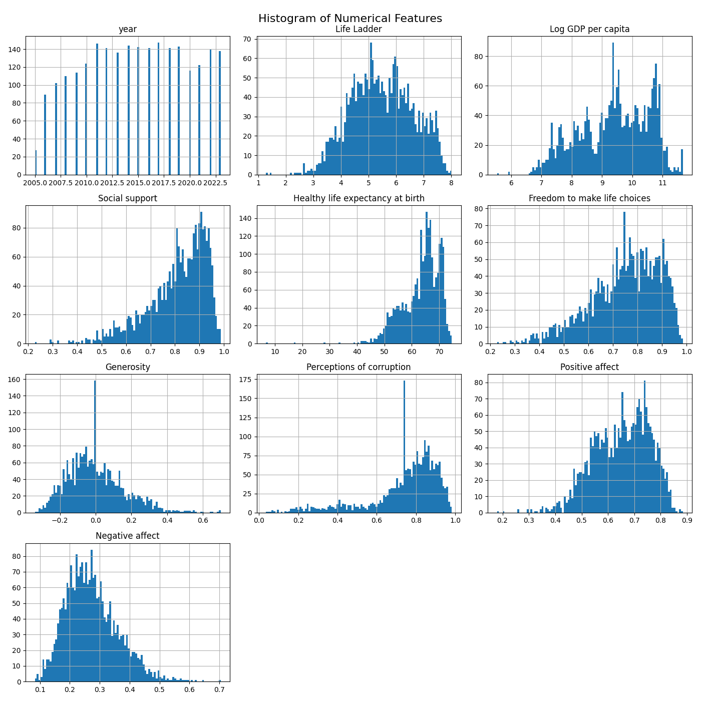

# Data Analysis Project 
Hey! Hope you are doing fine. Hmm... You've got some interesting data I  
see. Let's begin this journey with fist identifying what your data is like.  
So, you have got 2363 rows and 11 columns in your data and  
as I can see this data this data is related to Wellness. Below are some key  
statistics about the data you provided

## Key Statistics
|       |   year |   Life Ladder |   Log GDP per capita |   Social support |   Healthy life expectancy at birth |   Freedom to make life choices |   Generosity |   Perceptions of corruption |   Positive affect |   Negative affect |
|:------|-------:|--------------:|---------------------:|-----------------:|-----------------------------------:|-------------------------------:|-------------:|----------------------------:|------------------:|------------------:|
| count |   2363 |          2363 |                 2335 |             2350 |                               2300 |                           2327 |         2282 |                        2238 |              2339 |              2347 |
| mean  |   2014 |             5 |                    9 |                0 |                                 63 |                              0 |            0 |                           0 |                 0 |                 0 |
| std   |      5 |             1 |                    1 |                0 |                                  6 |                              0 |            0 |                           0 |                 0 |                 0 |
| min   |   2005 |             1 |                    5 |                0 |                                  6 |                              0 |            0 |                           0 |                 0 |                 0 |
| 25%   |   2011 |             4 |                    8 |                0 |                                 59 |                              0 |            0 |                           0 |                 0 |                 0 |
| 50%   |   2015 |             5 |                    9 |                0 |                                 65 |                              0 |            0 |                           0 |                 0 |                 0 |
| 75%   |   2019 |             6 |                   10 |                0 |                                 68 |                              0 |            0 |                           0 |                 0 |                 0 |
| max   |   2023 |             8 |                   11 |                0 |                                 74 |                              0 |            0 |                           0 |                 0 |                 0 |  
  
Let's move a little deeper and see what wonders the data is yet to reveal.
  
## Visualizing Data
Let's see how numerical columns correlate with each other  
  

  
In a world increasingly connected by data, this correlation heatmap unveils the intricate relationships between various factors influencing well-being and societal progress.

Our journey begins with the pursuit of happiness, represented by "Positive affect" and "Negative affect." The scales of emotions tilt significantly, as we see a clear negative correlation between "Negative affect" and "Healthy life expectancy at birth" (-0.47). This suggests that as we cultivate better health, negative emotions tend to diminish. Conversely, the positive shades around "Positive affect" reveal a positive correlation with factors like "Freedom to make choices" (0.42) and "Social support" (0.41), hinting that autonomy and community play crucial roles in fostering happiness.

As we venture deeper, the role of economic factors emerges. "Log GDP per capita" positively influences "Healthy life expectancy at birth" (0.78), suggesting that economic prosperity often translates into better health outcomes. Yet, it’s intriguing to note that while wealth aids health, it has a less direct relationship with emotional well-being, indicating that money alone might not buy happiness.

The element of generosity paints a compelling narrative. A positive correlation with "Social support" (0.47) indicates that communities built on generosity create networks of care, enhancing overall societal well-being. However, as the specter of corruption looms—evident in the negative correlation with both "Generosity" (-0.40) and "Positive affect" (-0.45)—the data cautions us that societal integrity is paramount for true progress.

Our journey through this heatmap reveals that happiness and well-being are multi-faceted, woven together by health, wealth, social ties, and moral integrity. It becomes clear that nurturing these connections can lead us toward a brighter, more fulfilling future. In the dance of numbers, it is the human element that resonates most profoundly, reminding us of the shared stories and experiences that define our lives. 

Now in the second figure we'll see numerical columns spread themselves.  
  

  
The histograms presented tell a compelling story about various factors contributing to well-being, reflected in the "Life Ladder" and other indicators.

Starting with the "year" histogram, we see a steady accumulation of data points over time, indicating that the tracking of these social metrics has become more robust and comprehensive.

The second histogram, "Life Ladder," shows a distribution that peaks in the higher range, suggesting that many individuals report high levels of well-being and satisfaction in their lives. This optimistic outlook is supported by the next visual—"Log GDP per capita," which, interestingly, reveals a skewed distribution towards higher values. This correlation hints at the economic foundation behind well-being; as wealth increases, so does the perceived quality of life.

Next, "Social support" presents a fairly normal distribution, suggesting that while many people experience strong community ties, there are some who feel isolated. Similarly, the "Healthy life expectancy at birth" histogram shows a positive skew, indicating that most individuals can expect to live healthy lives, though disparities likely exist within certain populations.

When we explore "Freedom to make life choices," the distribution leans positively, mirroring the findings of the "Life Ladder." People seem to value autonomy, which aligns with the favorable outlook on well-being.

In examining "Generosity" and "Perceptions of corruption," we see a dichotomy: a concentrated distribution for generosity indicates a significant portion of the population engages in altruistic behaviors. Meanwhile, the corruption perception histogram shows a stark contrast with a more uniform spread, suggesting varied experiences in political and social trust.

The final two metrics, "Positive affect" and "Negative affect," beautifully encapsulate the emotional landscape. The histogram for positive emotions is skewed towards the higher end, suggesting a predominance of joy and satisfaction, while the negative affect histogram, with its peak lower, indicates that while negativity exists, it’s less prevalent among the larger population.

Together, these visuals weave a narrative of a society striving towards happiness and well-being, underpinned by economic stability, social bonds, and personal freedoms, while also highlighting the nuances of generosity and trust that shape individual experiences.

Lastly, we'll see some mischievous datapoints that don't follow the trend (Outliers!).  
  

  
Once upon a time in the land of statistics, a curious researcher decided to delve into the lives of people across different nations, seeking to uncover the secrets behind their well-being and prosperity. The researcher turned to a set of box plots, each revealing a unique tale about life variables.

In the first plot, the **Year** unfolded—a narrative stretching from 2005 to 2020. It was a canvas of progress, painted with an upward trend that promised hope for a brighter future.

Next, the **Life Ladder** chart emerged, depicting a remarkable climb. Here, people seemed to score their lives on a scale of happiness and fulfillment, and the box plot hinted at a majority of individuals reporting satisfying levels of happiness. The highs spoke of joy, while the lows whispered of challenges.

As the journey continued, the researcher encountered the **Log GDP per capita** plot. This portrayal illuminated the wealth of nations, showcasing that while many thrived in economic prosperity, a few struggled—reflected by the outliers that reminded us of the disparities still lurking in the shadows.

Venturing further, the plot of **Social Support** revealed deeper connections among communities. Most people felt secure, but the whispers of a few echoed loudly, urging a reminder of loneliness in a world where connections are vital.

The tale then took a heartwarming turn with the **Healthy Life Expectancy at Birth** plot. It emphasized a promising outlook on health, where many children were born with a guarantee of a longer, healthier life—a joyful prospect for families everywhere.

Finally, the plot showcasing **Freedom to Make Life Choices** painted a picture of empowerment. Most felt liberated in their decisions, but just like in any great story, a handful of outliers reminded us that freedom isn’t universal, sparking thoughts of change and progress.

As the researcher compiled these tales, it became clear: each variable, woven together, told a larger story about the human experience—filled with triumphs, challenges, and a shared desire for growth. The journey through the box plots not only shed light on data but also illuminated the ongoing quest for a better life.

