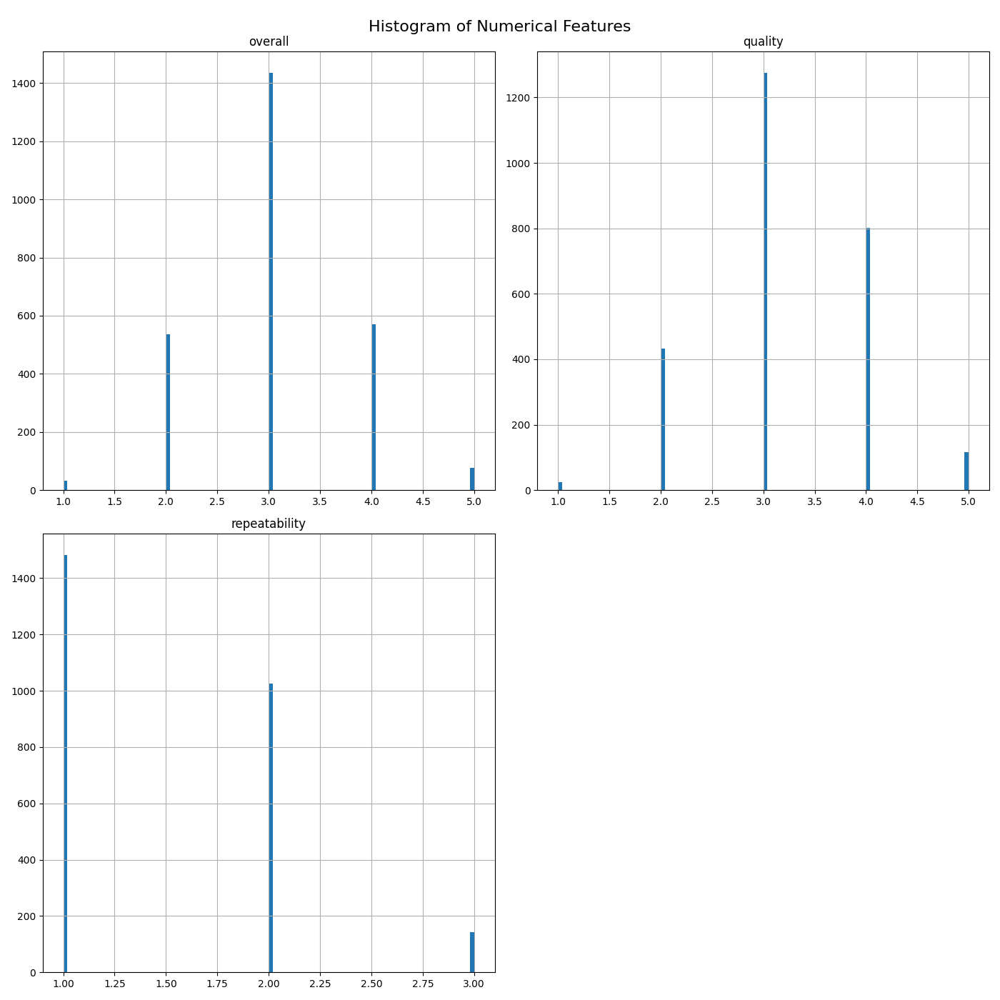
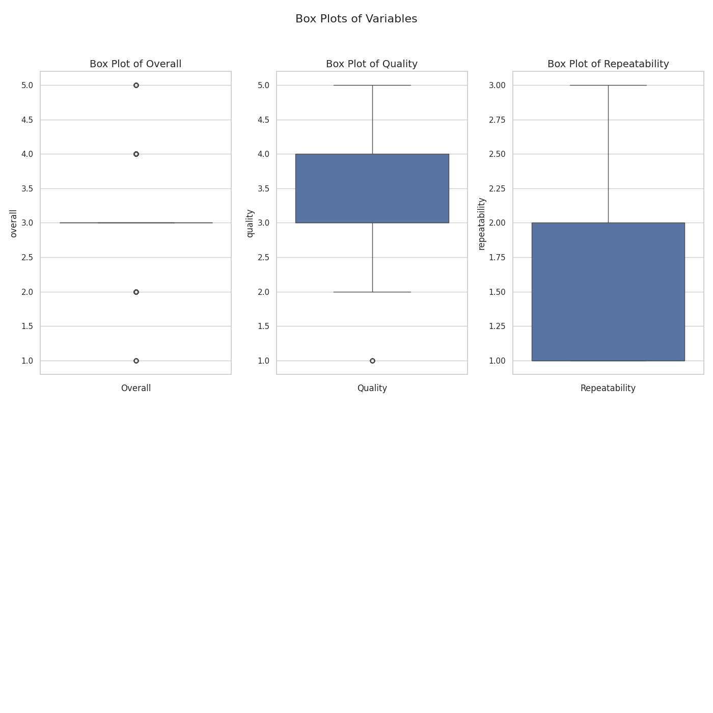

# Data Analysis Project 
Hey! Hope you are doing fine. Hmm... You've got some interesting data I see.  
Let's begin this journey with fist identifying what your data is like.  
So, you have got 100 rows and 500 columns in your data and as I can  
see this data is related to Reviews. Below are some key statistics  
about the data you provided  

## Key Statistics
|       |   overall |   quality |   repeatability |
|:------|----------:|----------:|----------------:|
| count |      2652 |      2652 |            2652 |
| mean  |         3 |         3 |               1 |
| std   |         0 |         0 |               0 |
| min   |         1 |         1 |               1 |
| 25%   |         3 |         3 |               1 |
| 50%   |         3 |         3 |               1 |
| 75%   |         3 |         4 |               2 |
| max   |         5 |         5 |               3 |  
  
Let's move a little deeper and see what wonders the data is yet to reveal.
  
## Visualizing Data
Let's see how numerical columns correlate with each other  
  

  
Once upon a time in the world of data analysis, a group of researchers delved into the relationships among three important factors: overall satisfaction, quality, and repeatability. They crafted a beautiful correlation heatmap to visualize their findings, and the results were intriguing.

In the warm hues of the heatmap, the researchers uncovered a striking connection between overall satisfaction and quality, represented by a strong correlation of 0.83. This indicated that as the quality of the product increased, so did the overall satisfaction of the users. The researchers celebrated this finding, knowing that focusing on quality could lead to happier customers.

Conversely, the relationship between quality and repeatability was weaker, with a correlation of only 0.31. This suggested that while quality is essential, it wasn’t directly tied to how consistently a product performed over time. The researchers saw this as an opportunity to investigate further—if improving repeatability could enhance overall satisfaction without compromising quality, they would have a winning formula.

Lastly, the connection between overall satisfaction and repeatability, also at 0.51, hinted at a moderate relationship. This indicated that while repeatable outcomes could contribute to a better overall experience, it was not as significant as the impact of quality.

As they wrapped up their analysis, the researchers knew they had a story to tell—a narrative of interconnected factors where quality took the lead, guiding repeatability and overall satisfaction in their quest for excellence in product development. This heatmap was not just a collection of numbers; it was a pathway to better understanding and improving their offerings in the marketplace, ensuring that with every step taken toward quality, they were writing their success story. 

Now in the second figure we'll see numerical columns spread themselves.  
  

  
Once upon a time in the realm of data analysis, a curious data scientist stumbled upon a treasure trove of insights in the form of three distinct histograms. Each histogram represented a different aspect of a mysterious dataset: overall scores, quality ratings, and repeatability measures.

In the first plot—the “Overall” histogram—the peaks were sharp and clear. Most scores congregated around a central value, suggesting that the majority of observations had a common experience or characteristic, while a few ventured into the realm of high scores, indicating stellar outliers. The concentration of data points suggested that many subjects had familiar outcomes, creating an air of predictability around this variable.

Next came the “Quality” histogram, which mirrored the overall pattern, showing a substantial collection of scores at certain intervals. This high frequency of specific ratings hinted that these qualities were not just random occurrences; rather, they suggested a standardized assessment where many entities achieved similar grades. However, the relative scarcity of lower scores brought a sense of reassurance: quality was generally upheld across the dataset, though there remained a few that fell short.

Finally, the “Repeatability” histogram introduced an unexpected twist. Here, the scores were densely clustered at the lowest end of the spectrum, with a long tail disappearing into the distance. This stark contrast to the previous histograms implied challenges regarding consistency; many instances were never repeated or were measured inconsistently. Perhaps a call for improvement or a change in methodology was needed to enhance this crucial aspect.

In conclusion, these histograms whispered stories of a dataset balanced with success and shadows of inconsistency. Each told a part of a larger narrative, revealing areas of strength and opportunity—an adventure waiting to be explored further.

Lastly, we'll see some mischievous datapoints that don't follow the trend (Outliers!).  
  

  
Once upon a time in the realm of data analysis, three brave variables emerged, each with its own unique story to tell through the magic of box plots.

### The Journey of Overall
First, we encountered **Overall**, standing quietly with a narrow range and a median resting close to the lower end of the scale. The box plot revealed that the overall values were tightly clustered, hinting at a consistency that spoke of reliability. Yet, there were whispers of outliers, serving as reminders of the occasional unexpected twist in the tale.

### The Tale of Quality
Next, we ventured into the domain of **Quality**, where the plot unfolded with a broader range. Here, the median held its ground around the midpoint, suggesting that while most values shared a common ground, there were notable fluctuations across the realm. The presence of the interquartile range (IQR) illustrated diverse experiences in quality, leaving room for improvement, but also showcasing pockets of excellence.

### The Saga of Repeatability
Finally, we arrived at **Repeatability**, where the box plot stood tall and expressive. The median once again took center stage at a lower value, surrounded by a generous interquartile range. This plot told of a challenge: while it showed promise, the variability indicated that outcomes were not as consistent as one would hope. The outliers beckoned attention, urging the need for further exploration and understanding.

### Conclusion
In summary, each box plot shared its narrative. **Overall** displayed consistency, **Quality** revealed a mix of experiences, and **Repeatability** called for further investigation into its variability. Together, they wove a tapestry of insights, guiding us towards a deeper understanding of the data landscape and the stories it holds. As we closed this chapter, we were reminded that every variable has its role, waiting to be unraveled and understood in the grand narrative of analysis.

