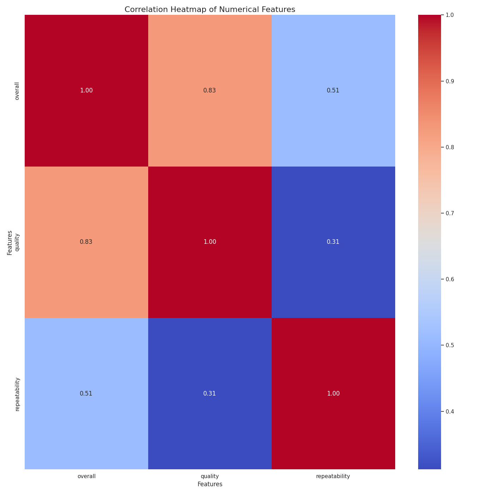

# Data Analysis Project 
Hey! Hope you are doing fine. Hmm... You've got some interesting data I see.  
Let's begin this journey by first identifying what your data is like.  
So, you have got 2652 rows and 8 columns in your data, and as I can  
see, this data is related to Reviews. Below are some key statistics  
about the data you provided:

## Missing Value Analysis
The dataset contains the following missing values:

| Column        |   Missing Values |   Percentage |
|:--------------|-----------------:|-------------:|
| date          |               99 |         3.73 |
| language      |                0 |         0    |
| type          |                0 |         0    |
| title         |                0 |         0    |
| by            |              262 |         9.88 |
| overall       |                0 |         0    |
| quality       |                0 |         0    |
| repeatability |                0 |         0    |

## Advanced Statistical Analysis
|               |   mean |   std |   min |   25% |   50% |   75% |   max |   Skewness |   Kurtosis |
|:--------------|-------:|------:|------:|------:|------:|------:|------:|-----------:|-----------:|
| overall       |   3.05 |  0.76 |     1 |     3 |     3 |     3 |     5 |       0.16 |       0.15 |
| quality       |   3.21 |  0.8  |     1 |     3 |     3 |     4 |     5 |       0.02 |      -0.17 |
| repeatability |   1.49 |  0.6  |     1 |     1 |     1 |     2 |     3 |       0.78 |      -0.38 |  
  
Let's move a little deeper and see what wonders the data is yet to reveal.
  
## Visualizing Data
### Correlation Heatmap
Understanding how numerical columns correlate with each other can provide insights into potential relationships and dependencies between variables. Here's a heatmap showing these correlations:

  
Once upon a time in the land of data, three noble features—**Overall**, **Quality**, and **Repeatability**—came together in a grand castle of insights. The correlation heatmap served as a magical mirror, reflecting the relationships between these features.

As the nobles gathered, **Overall** stood tall, boasting a strong bond with **Quality**, reflected in a sturdy correlation of **0.83**. It whispered tales of how the overall experience was deeply shaped by the quality of their efforts, capturing the hearts of all who interacted with them.

Yet, the connection with **Repeatability** was more modest, a gentle **0.51**, suggesting that while there was some camaraderie, it wasn't as robust. The noble **Repeatability** yearned for stronger ties, realizing that consistency could elevate its standing among the others.

Meanwhile, **Quality** noticed its own relationships. While it felt cherished by **Overall**, it shared a lighter connection with **Repeatability**, measured at **0.31**. This revealed an opportunity for growth—quality could enhance repeatability, ensuring that their achievements were not mere whims of chance but a reliable pattern.

As the narrative unfolded, the castle echoed with potential. Together, they pondered strategies to deepen their connections, recognizing that the stronger their relationships, the richer their contributions to the kingdom of insights would be. Thus, the three features ventured forth, ready to forge paths of collaboration and understanding, ensuring their legacy would be one of harmony and success. 

### Histograms
Histograms help us understand the distribution of numerical columns. They can reveal patterns such as skewness, modality, and the presence of outliers. Here's a look at the histograms for the numerical columns:

  
Once upon a time in a bustling data landscape, three powerful stories were waiting to be uncovered through their histograms: **Overall**, **Quality**, and **Repeatability**.

As we ventured into the **Overall** histogram, we noticed a striking peak at the value of 2. This told us that most observations clustered around this number, hinting at a commonality in the data that begged us to explore further. With fewer counts in the upper values, it seemed that achieving higher overall scores was a challenge for most.

Next, our journey led us to the **Quality** histogram. Here, a similar pattern emerged: a dramatic peak at 2, followed by a slow decline. It hinted at a realm where quality was often perceived as moderate, with few instances reaching the heights of 4 or 5. The story was clear: many entities felt they only met basic quality standards, and aspirations soared higher yet were seldom realized.

Finally, we encountered the **Repeatability** histogram. This one stood out as rather unique, with virtually all data points condensing into a small range, creating an unusually narrow peak at around 1.75. This suggested that repeatability, perhaps a crucial factor in our exploration, was predominantly low, raising questions about consistency and reliability in the processes being assessed.

Through these vivid narratives of histograms, a picture unfolded: a landscape where the quest for better quality and more consistent outcomes began, yet stagnated at fundamental levels. It was a call to action—to dive deeper into the data, seeking ways to elevate overall performance and enhance quality, thereby bringing forth the stories that lay ahead.

### Box Plots
Box plots are useful for identifying outliers and understanding the spread and central tendency of the data. Here's a look at the box plots for the numerical columns:

  
In the expansive realm of data analysis, three box plots emerge as vivid storytellers, each narrating a unique tale about the variables we’re examining: Overall, Quality, and Repeatability.

First, let’s wander into the landscape of the **Overall** box plot. Imagine a serene field, where the median stands tall at a commendable 4.0, suggesting a generally favorable result. However, tiny outliers whisper stories of exceptions, perhaps areas where the performance has dipped unpredictably, revealing opportunities for deeper exploration and improvement.

Next, as we step into the **Quality** box plot, the tale shifts slightly. Here, the median reveals itself at 3.5, reminiscent of an industrious workspace with moments of excellence but also some inconsistencies. The range, with its noticeable spread, indicates varying experiences—some fortunate enough to enjoy high quality while others grapple with lower scores. The outliers lurking at the edges beckon for attention, hinting at significant flaws or remarkable successes worth investigating.

Finally, we find ourselves in the domain of **Repeatability**. This narrative is more somber, with a median resting at just 1.5, hinting at challenges with consistency. The box is notably shorter, enveloping a narrower range, which denotes a struggle to maintain quality over repeated tests. The single outlier here might represent an extraordinary case, perhaps a triumph that stands against the trend, yet highlights the pressing need for improvement in this area.

Together, these box plots weave a complex tapestry of insights: while the Overall variable hints at promise, Quality and particularly Repeatability signal areas ripe for development. This data-driven narrative encourages us to delve deeper, uncovering hidden stories that lie beneath the surface of these visual representations.

## Chi-Square Test Reports
Chi-square tests help us understand the relationships between categorical variables. Here are the results of the chi-square tests for pairs of categorical columns:

### Chi-Square Test for date and language

| Metric | Value |
| --- | --- |
| Chi-Square Statistic | 20570.5270 |
| p-value | 0.4389 |
| Degrees of Freedom | 20540 |
| Expected Frequencies | [[7.83392088e-04 4.73560517e-01 3.91696044e-04 ... 3.91696044e-04
  2.81237759e-01 1.32393263e-01]
 [7.83392088e-04 4.73560517e-01 3.91696044e-04 ... 3.91696044e-04
  2.81237759e-01 1.32393263e-01]
 [7.83392088e-04 4.73560517e-01 3.91696044e-04 ... 3.91696044e-04
  2.81237759e-01 1.32393263e-01]
 ...
 [7.83392088e-04 4.73560517e-01 3.91696044e-04 ... 3.91696044e-04
  2.81237759e-01 1.32393263e-01]
 [7.83392088e-04 4.73560517e-01 3.91696044e-04 ... 3.91696044e-04
  2.81237759e-01 1.32393263e-01]
 [7.83392088e-04 4.73560517e-01 3.91696044e-04 ... 3.91696044e-04
  2.81237759e-01 1.32393263e-01]] |

### Chi-Square Test for date and type

| Metric | Value |
| --- | --- |
| Chi-Square Statistic | 15493.1025 |
| p-value | 0.0000 |
| Degrees of Freedom | 14378 |
| Expected Frequencies | [[0.04386996 0.07677242 0.82726204 ... 0.00744222 0.00156678 0.01645123]
 [0.04386996 0.07677242 0.82726204 ... 0.00744222 0.00156678 0.01645123]
 [0.04386996 0.07677242 0.82726204 ... 0.00744222 0.00156678 0.01645123]
 ...
 [0.04386996 0.07677242 0.82726204 ... 0.00744222 0.00156678 0.01645123]
 [0.04386996 0.07677242 0.82726204 ... 0.00744222 0.00156678 0.01645123]
 [0.04386996 0.07677242 0.82726204 ... 0.00744222 0.00156678 0.01645123]] |

### Chi-Square Test for date and title

| Metric | Value |
| --- | --- |
| Chi-Square Statistic | 4545618.8639 |
| p-value | 1.0000 |
| Degrees of Freedom | 4578366 |
| Expected Frequencies | [[0.0003917 0.0003917 0.0003917 ... 0.0003917 0.0003917 0.0003917]
 [0.0003917 0.0003917 0.0003917 ... 0.0003917 0.0003917 0.0003917]
 [0.0003917 0.0003917 0.0003917 ... 0.0003917 0.0003917 0.0003917]
 ...
 [0.0003917 0.0003917 0.0003917 ... 0.0003917 0.0003917 0.0003917]
 [0.0003917 0.0003917 0.0003917 ... 0.0003917 0.0003917 0.0003917]
 [0.0003917 0.0003917 0.0003917 ... 0.0003917 0.0003917 0.0003917]] |

### Chi-Square Test for date and by

| Metric | Value |
| --- | --- |
| Chi-Square Statistic | 2954953.2849 |
| p-value | 0.0000 |
| Degrees of Freedom | 2928632 |
| Expected Frequencies | [[0.00042105 0.00042105 0.00042105 ... 0.00042105 0.00042105 0.00042105]
 [0.00042105 0.00042105 0.00042105 ... 0.00042105 0.00042105 0.00042105]
 [0.00042105 0.00042105 0.00042105 ... 0.00042105 0.00042105 0.00042105]
 ...
 [0.00042105 0.00042105 0.00042105 ... 0.00042105 0.00042105 0.00042105]
 [0.00042105 0.00042105 0.00042105 ... 0.00042105 0.00042105 0.00042105]
 [0.00042105 0.00042105 0.00042105 ... 0.00042105 0.00042105 0.00042105]] |

### Chi-Square Test for language and type

| Metric | Value |
| --- | --- |
| Chi-Square Statistic | 829.0961 |
| p-value | 0.0000 |
| Degrees of Freedom | 70 |
| Expected Frequencies | [[1.26696833e-01 2.21719457e-01 2.50113122e+00 6.78733032e-02
  9.04977376e-03 2.14932127e-02 4.52488688e-03 4.75113122e-02]
 [5.51553544e+01 9.65218703e+01 1.08882579e+03 2.95475113e+01
  3.93966817e+00 9.35671192e+00 1.96983409e+00 2.06832579e+01]
 [4.22322775e-02 7.39064857e-02 8.33710407e-01 2.26244344e-02
  3.01659125e-03 7.16440422e-03 1.50829563e-03 1.58371041e-02]
 [8.44645551e-02 1.47812971e-01 1.66742081e+00 4.52488688e-02
  6.03318250e-03 1.43288084e-02 3.01659125e-03 3.16742081e-02]
 [1.06003017e+01 1.85505279e+01 2.09261312e+02 5.67873303e+00
  7.57164404e-01 1.79826546e+00 3.78582202e-01 3.97511312e+00]
 [5.06787330e-01 8.86877828e-01 1.00045249e+01 2.71493213e-01
  3.61990950e-02 8.59728507e-02 1.80995475e-02 1.90045249e-01]
 [4.22322775e-02 7.39064857e-02 8.33710407e-01 2.26244344e-02
  3.01659125e-03 7.16440422e-03 1.50829563e-03 1.58371041e-02]
 [8.02413273e-01 1.40422323e+00 1.58404977e+01 4.29864253e-01
  5.73152338e-02 1.36123680e-01 2.86576169e-02 3.00904977e-01]
 [4.22322775e-02 7.39064857e-02 8.33710407e-01 2.26244344e-02
  3.01659125e-03 7.16440422e-03 1.50829563e-03 1.58371041e-02]
 [3.03227753e+01 5.30648567e+01 5.98604072e+02 1.62443439e+01
  2.16591252e+00 5.14404223e+00 1.08295626e+00 1.13710407e+01]
 [1.42745098e+01 2.49803922e+01 2.81794118e+02 7.64705882e+00
  1.01960784e+00 2.42156863e+00 5.09803922e-01 5.35294118e+00]] |

### Chi-Square Test for language and title

| Metric | Value |
| --- | --- |
| Chi-Square Statistic | 26334.1340 |
| p-value | 0.0000 |
| Degrees of Freedom | 23110 |
| Expected Frequencies | [[1.13122172e-03 1.13122172e-03 1.13122172e-03 ... 1.13122172e-03
  1.13122172e-03 1.13122172e-03]
 [4.92458522e-01 4.92458522e-01 4.92458522e-01 ... 4.92458522e-01
  4.92458522e-01 4.92458522e-01]
 [3.77073906e-04 3.77073906e-04 3.77073906e-04 ... 3.77073906e-04
  3.77073906e-04 3.77073906e-04]
 ...
 [3.77073906e-04 3.77073906e-04 3.77073906e-04 ... 3.77073906e-04
  3.77073906e-04 3.77073906e-04]
 [2.70739065e-01 2.70739065e-01 2.70739065e-01 ... 2.70739065e-01
  2.70739065e-01 2.70739065e-01]
 [1.27450980e-01 1.27450980e-01 1.27450980e-01 ... 1.27450980e-01
  1.27450980e-01 1.27450980e-01]] |

### Chi-Square Test for language and by

| Metric | Value |
| --- | --- |
| Chi-Square Statistic | 18226.2025 |
| p-value | 0.0000 |
| Degrees of Freedom | 12216 |
| Expected Frequencies | [[8.36820084e-04 8.36820084e-04 8.36820084e-04 ... 8.36820084e-04
  8.36820084e-04 8.36820084e-04]
 [4.54811715e-01 4.54811715e-01 4.54811715e-01 ... 4.54811715e-01
  4.54811715e-01 4.54811715e-01]
 [4.18410042e-04 4.18410042e-04 4.18410042e-04 ... 4.18410042e-04
  4.18410042e-04 4.18410042e-04]
 ...
 [7.94979079e-03 7.94979079e-03 7.94979079e-03 ... 7.94979079e-03
  7.94979079e-03 7.94979079e-03]
 [2.96234310e-01 2.96234310e-01 2.96234310e-01 ... 2.96234310e-01
  2.96234310e-01 2.96234310e-01]
 [1.36820084e-01 1.36820084e-01 1.36820084e-01 ... 1.36820084e-01
  1.36820084e-01 1.36820084e-01]] |

### Chi-Square Test for type and title

| Metric | Value |
| --- | --- |
| Chi-Square Statistic | 18094.2420 |
| p-value | 0.0000 |
| Degrees of Freedom | 16177 |
| Expected Frequencies | [[0.04223228 0.04223228 0.04223228 ... 0.04223228 0.04223228 0.04223228]
 [0.07390649 0.07390649 0.07390649 ... 0.07390649 0.07390649 0.07390649]
 [0.83371041 0.83371041 0.83371041 ... 0.83371041 0.83371041 0.83371041]
 ...
 [0.0071644  0.0071644  0.0071644  ... 0.0071644  0.0071644  0.0071644 ]
 [0.0015083  0.0015083  0.0015083  ... 0.0015083  0.0015083  0.0015083 ]
 [0.0158371  0.0158371  0.0158371  ... 0.0158371  0.0158371  0.0158371 ]] |

### Chi-Square Test for type and by

| Metric | Value |
| --- | --- |
| Chi-Square Statistic | 15971.2574 |
| p-value | 0.0000 |
| Degrees of Freedom | 10689 |
| Expected Frequencies | [[0.02677824 0.02677824 0.02677824 ... 0.02677824 0.02677824 0.02677824]
 [0.08033473 0.08033473 0.08033473 ... 0.08033473 0.08033473 0.08033473]
 [0.84560669 0.84560669 0.84560669 ... 0.84560669 0.84560669 0.84560669]
 ...
 [0.00543933 0.00543933 0.00543933 ... 0.00543933 0.00543933 0.00543933]
 [0.00125523 0.00125523 0.00125523 ... 0.00125523 0.00125523 0.00125523]
 [0.0125523  0.0125523  0.0125523  ... 0.0125523  0.0125523  0.0125523 ]] |

### Chi-Square Test for title and by

| Metric | Value |
| --- | --- |
| Chi-Square Statistic | 3576819.2435 |
| p-value | 0.0000 |
| Degrees of Freedom | 3156309 |
| Expected Frequencies | [[0.00041841 0.00041841 0.00041841 ... 0.00041841 0.00041841 0.00041841]
 [0.00041841 0.00041841 0.00041841 ... 0.00041841 0.00041841 0.00041841]
 [0.00041841 0.00041841 0.00041841 ... 0.00041841 0.00041841 0.00041841]
 ...
 [0.00041841 0.00041841 0.00041841 ... 0.00041841 0.00041841 0.00041841]
 [0.00041841 0.00041841 0.00041841 ... 0.00041841 0.00041841 0.00041841]
 [0.00041841 0.00041841 0.00041841 ... 0.00041841 0.00041841 0.00041841]] |

